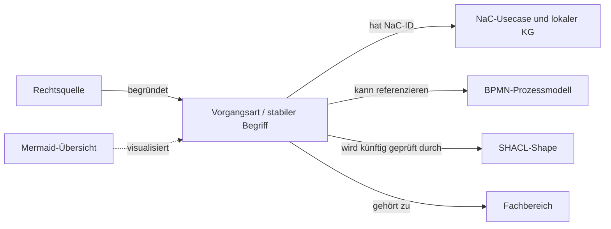

# Notariats-Ontologie für NaC

Dieses Repository pflegt eine **fallbezogene Ontologie für deutsche Notariate**. Es ist derzeit privat; eine öffentliche Webadresse wird später festgelegt. Für jeden der 20 NaC-Fälle gibt es eine [Turtle-Ontologie und eine Mermaid-Sicht](cases/README.md). Das gemeinsame [Vokabular](ontology/core.ttl) definiert die Bausteine und Beziehungen. Die [Forschungs- und Architekturentscheidung](docs/architekturentscheidung-2026-09-26.md) erklärt den Bezug zu NaC.

**Verbindlicher Startumfang:** genau die [20 kanonischen NaC-Vorgangsarten](catalog/nac-baseline.json). Die zwei historischen NaC-Aliase zählen nicht dazu. Zusätzliche Arten werden in diesem Stand nicht aufgenommen. Das ist keine vollständige Taxonomie aller denkbaren notariellen Tätigkeiten und keine rechtliche Freigabe.



## Dateien und Zuständigkeit

| Datei | Zweck |
| --- | --- |
| [ontology/core.ttl](ontology/core.ttl) | Fachklassen und Eigenschaften; maschinenlesbares Vokabular |
| [catalog/nac-usecases.ttl](catalog/nac-usecases.ttl) | NaC-Basiskatalog mit stabilen `BusinessCaseTypeId`-Werten |
| [catalog/nac-baseline.json](catalog/nac-baseline.json) | Festgeschriebener 20-ID-Abgleich mit NaC |
| [cases/README.md](cases/README.md) | Einstieg zu allen 20 fallbezogenen TTL-Dateien und Mermaid-Diagrammen |
| [docs/architekturentscheidung-2026-09-26.md](docs/architekturentscheidung-2026-09-26.md) | Quellen, Alternativen, Grenzen, Integrationsplan |

Die lokale und GitHub-CI-Prüfung lautet nach Installation von [requirements.txt](requirements.txt): `python scripts/validate_catalog.py`, `python scripts/validate_cases.py` und `python scripts/render_case_docs.py --check`. Sie prüft Turtle-Syntax, exakt 20 Fallmodule, ihre fachlichen Knotentypen, Beziehungen und die Synchronität der Mermaid-Seiten. Mit `--nac-root <Pfad-zum-NaC-Checkout>` können Katalog und Fallmodule zusätzlich gegen den gepinnten NaC-Stand geprüft werden. Die fachliche Prüfung bleibt ein eigener Review-Schritt.

## Im Browser bearbeiten

Der [gehostete Editor](docs/editor-hosting.md) ist als einzelner Cloud-Dienst mit GitHub-App-Anmeldung und GitHub als Datenquelle implementiert, aber noch nicht bereitgestellt oder mit notariellen Testpersonen abgenommen. Die folgenden Schritte starten die lokale Entwicklungsvariante.

Der [Editor](editor/index.html) bietet für die 20 Fälle eine lesbare Fallübersicht, eine Suche nach Fachbausteinen, eine fokussierte Beziehungsansicht und eine geprüfte Änderungsvorschau. Im Bereich **Gemeinsame Begriffe** lassen sich zusätzlich die Klassen, Merkmale und Verbindungstypen aus `ontology/core.ttl` lesen und pflegen. Zu jedem Begriff zeigt die Oberfläche seine technische Verwendung in den 20 Fällen und öffnet den gewählten Fall direkt. Turtle-Syntax muss dafür nicht geschrieben werden. Für die Vokabularpflege ist im gehosteten Dienst ein eingetragenes Ontologie-Maintainer-Konto nötig. Die gleiche Oberfläche läuft lokal und im gehosteten Dienst; die Cloud-Bereitstellung mit echten GitHub-Konten steht noch aus. Auf Windows nach Installation von Python:

Die aus NaC übernommenen technischen Entscheidungswerte haben noch keine fachlich geprüften Anzeigenamen. Der Editor kennzeichnet diese Lücke; die Modell- und Freigabeentscheidung steht in [Issue #8](https://github.com/notariat8/ontology/issues/8).

```powershell
python -m venv .venv
.\.venv\Scripts\python.exe -m pip install -r requirements.txt
.\.venv\Scripts\python.exe scripts/case_editor.py
```

Der Browser öffnet `http://127.0.0.1:8765/`. Mit **Änderung beginnen** wird bei Bedarf ein Git-Arbeitszweig für den gewählten Bereich angelegt. **Änderung speichern** zeigt zuerst eine fachliche Vorschau und schreibt nach Bestätigung beim Fall das Turtle-Modul samt Mermaid-Seite oder beim gemeinsamen Vokabular nur `ontology/core.ttl`. **Zur Fachprüfung einreichen** veröffentlicht genau diese Änderung mit Begründung und Quellenstand. Dafür müssen Git-Push und `gh` für dieses Repository eingerichtet sein. Der PR ist noch keine notarielle Fachfreigabe. Im gehosteten Dienst gibt es zusätzlich einen Prüfkorb für berechtigte Notarkonten; seine Einrichtung ist im [Betriebsvertrag](docs/editor-hosting.md) beschrieben. Neue Fallbausteine tragen eine `local.`-Kennung und bleiben als lokale Entwürfe von den importierten NaC-Knoten unterscheidbar. Der NaC-Abgleich mit `--nac-root` kann nach fachlichen Erweiterungen erwartungsgemäß eine Abweichung melden; der konkrete NaC-Commit und diese Abweichung müssen im Pull Request benannt werden. Keine Mandatsdaten in den Editor eingeben.

Die Ontologie beschreibt **was** eine Vorgangsart ist und welche Angabenfragen, Dokumenttypen, Entscheidungen, Prüfgates und Nachweistypen ihre Vorlage enthält. Die Fallmodule übernehmen deren gerichtete Beziehungen aus NaC und sind hier die Pflegequelle. NaC-BPMN beschreibt **wie** ein bestimmter Ablauf verläuft. Mermaid wird aus Turtle erzeugt. SHACL soll später Qualitätsregeln für Turtle-Daten prüfen. Laufende Akten, Personendaten und Dokumentinhalte gehören nicht in dieses GitHub-Repository.

## Zuständigkeit und Pflege

NaC pflegt den führenden Usecase-Katalog über GitOps. Änderungen an diesem RDF-Katalog erfolgen über Issue, Branch, Pull Request, Prüfung und dokumentierte Freigabe. Notarinnen und Notare übernehmen die fachliche Reviewer-Rolle für Begriffe, Rechtsquellen und fachliche Beziehungen; die technische Pflege und der NaC-Abgleich liegen im GitOps-Prozess. Die konkreten Reviewer-Konten sind noch nicht benannt. Der [PR-Vordruck](.github/pull_request_template.md) hält die Nachweise fest.

Für einen Fall die jeweilige [Turtle-Datei](cases/README.md) ändern und mit `python scripts/render_case_docs.py --write` die Mermaid-Sicht aktualisieren. Der erstmalige Import aus NaC ist in [bootstrap_from_nac.py](scripts/bootstrap_from_nac.py) reproduzierbar dokumentiert; das Skript überschreibt bestehende Fallontologien absichtlich nicht. Die aus NaC übernommenen `open`-Angaben sind **Vorlagenfragen**, keine Daten oder Status realer Mandate. Die 20 Module wurden noch nicht notariell fachgeprüft.

Die in Turtle verwendete IRI-Basis `https://notariat8.github.io/ontology/id/` ist derzeit ein **technischer Bezeichner aus dem ersten Stand**, keine beschlossene Webadresse oder nachgewiesene Website. Die Entscheidung über Auflösung und Hosting wird später getroffen. Bis dahin sind die Git-Dateien der Abrufpfad; eine Änderung der IRI-Basis wäre eine bewusste Migration.

## Lizenz und weiterer Ausbau

Wie bei NaC stehen fachliche Inhalte und Diagramme unter `CC-BY-4.0`, ausführbare Validatoren unter `AGPL-3.0-or-later`; siehe [Lizenzzuordnung](LICENSES/README.md) und [Herkunftshinweis](NOTICE). SHACL-Core-Shapes können später für diese 20 Fälle ergänzt werden. Eine Erweiterung über die 20 Fälle hinaus braucht eine neue gemeinsame Umfangsentscheidung mit NaC.
