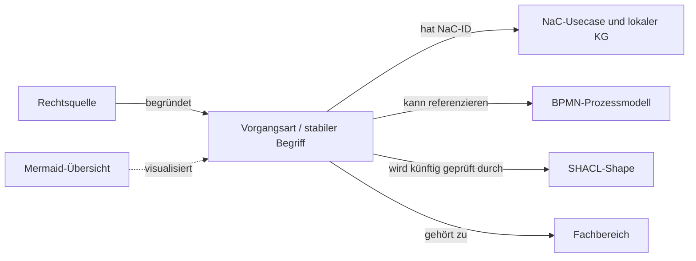

# Notariats-Ontologie für NaC

Dieses Repository entwickelt einen **versionierten Fachwortschatz für deutsche Notariate**. Es ist derzeit privat; eine öffentliche Webadresse wird später festgelegt. Es beschreibt Vorgangsarten und ihre Beziehungen in [Turtle](ontology/core.ttl) und [Turtle-Katalogdaten](catalog/nac-usecases.ttl). Ein Diagramm gibt Menschen den Einstieg. Die [Forschungs- und Architekturentscheidung](docs/architekturentscheidung-2026-09-26.md) erklärt den Bezug zu NaC.

**Verbindlicher Startumfang:** genau die [20 kanonischen NaC-Vorgangsarten](catalog/nac-baseline.json). Die zwei historischen NaC-Aliase zählen nicht dazu. Zusätzliche Arten werden in diesem Stand nicht aufgenommen. Das ist keine vollständige Taxonomie aller denkbaren notariellen Tätigkeiten und keine rechtliche Freigabe.

## Dateien und Zuständigkeit

| Datei | Zweck |
| --- | --- |
| [ontology/core.ttl](ontology/core.ttl) | Fachklassen und Eigenschaften; maschinenlesbares Vokabular |
| [catalog/nac-usecases.ttl](catalog/nac-usecases.ttl) | NaC-Basiskatalog mit stabilen `BusinessCaseTypeId`-Werten |
| [catalog/nac-baseline.json](catalog/nac-baseline.json) | Festgeschriebener 20-ID-Abgleich mit NaC |
| [docs/architekturentscheidung-2026-09-26.md](docs/architekturentscheidung-2026-09-26.md) | Quellen, Alternativen, Grenzen, Integrationsplan |

Die lokale und GitHub-CI-Prüfung lautet nach Installation von [requirements.txt](requirements.txt): `python scripts/validate_catalog.py`. Sie prüft Turtle-Syntax, Katalogstruktur und die exakten 20 IDs. Mit `python scripts/validate_catalog.py --nac-root <Pfad-zum-NaC-Checkout>` prüft sie zusätzlich die Usecase- und BPMN-Dateien im NaC-Checkout. Die fachliche Prüfung bleibt ein eigener Review-Schritt.

Die Ontologie beschreibt **was** eine Vorgangsart ist und welche Konzepte dazugehören. NaC-BPMN beschreibt **wie** ein bestimmter Ablauf verläuft. Mermaid ist nur die Lesesicht. SHACL soll später Pflichtangaben und Qualitätsregeln für Turtle-Daten prüfen. Laufende Akten, Personendaten und Dokumentinhalte gehören nicht in dieses GitHub-Repository.

## Zuständigkeit und Pflege

NaC pflegt den führenden Usecase-Katalog über GitOps. Änderungen an diesem RDF-Katalog erfolgen über Issue, Branch, Pull Request, Prüfung und dokumentierte Freigabe. Notarinnen und Notare übernehmen die fachliche Reviewer-Rolle für Begriffe, Rechtsquellen und fachliche Beziehungen; die technische Pflege und der NaC-Abgleich liegen im GitOps-Prozess. Die konkreten Reviewer-Konten sind noch nicht benannt. Der [PR-Vordruck](.github/pull_request_template.md) hält die Nachweise fest.

Die in Turtle verwendete IRI-Basis `https://notariat8.github.io/ontology/id/` ist derzeit ein **technischer Bezeichner aus dem ersten Stand**, keine beschlossene Webadresse oder nachgewiesene Website. Die Entscheidung über Auflösung und Hosting wird später getroffen. Bis dahin sind die Git-Dateien der Abrufpfad; eine Änderung der IRI-Basis wäre eine bewusste Migration.

## Lizenz und weiterer Ausbau

Wie bei NaC stehen fachliche Inhalte und Diagramme unter `CC-BY-4.0`, ausführbare Validatoren unter `AGPL-3.0-or-later`; siehe [Lizenzzuordnung](LICENSES/README.md) und [Herkunftshinweis](NOTICE). SHACL-Core-Shapes können später für diese 20 Fälle ergänzt werden. Eine Erweiterung über die 20 Fälle hinaus braucht eine neue gemeinsame Umfangsentscheidung mit NaC.
