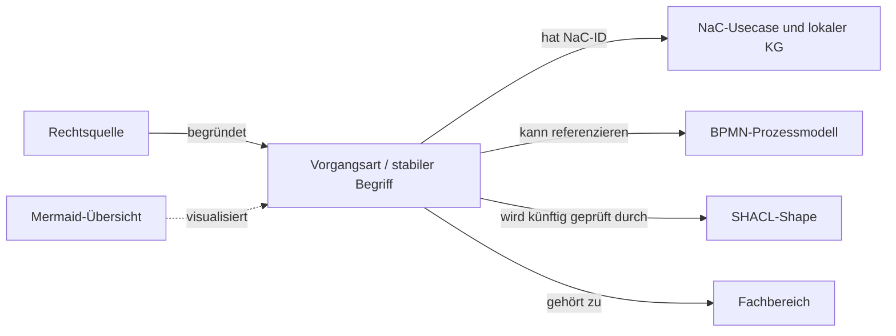

# Notariats-Ontologie für NaC

Dieses Repository entwickelt einen **öffentlichen, versionierten Fachwortschatz für deutsche Notariate**. Es beschreibt Vorgangsarten und ihre Beziehungen in [Turtle](ontology/core.ttl) und [Turtle-Katalogdaten](catalog/nac-usecases.ttl). Ein Diagramm gibt Menschen den Einstieg. Die [Forschungs- und Architekturentscheidung](docs/architekturentscheidung-2026-09-26.md) erklärt den Bezug zu NaC.

**Stand 26.09.2026:** Das ist ein erster, aus NaC abgeleiteter Katalog mit 20 kanonischen Vorgangsarten. Er ist keine vollständige Taxonomie aller denkbaren notariellen Tätigkeiten und keine rechtliche Freigabe. Zwei historische NaC-Aliase werden nicht als neue Arten gezählt. Fachliche Ergänzungen sind vorgesehen.

## Dateien und Zuständigkeit

| Datei | Zweck |
| --- | --- |
| [ontology/core.ttl](ontology/core.ttl) | Fachklassen und Eigenschaften; maschinenlesbares Vokabular |
| [catalog/nac-usecases.ttl](catalog/nac-usecases.ttl) | NaC-Basiskatalog mit stabilen `BusinessCaseTypeId`-Werten |
| [docs/architekturentscheidung-2026-09-26.md](docs/architekturentscheidung-2026-09-26.md) | Quellen, Alternativen, Grenzen, Integrationsplan |

Die lokale und GitHub-CI-Prüfung lautet nach Installation von [requirements.txt](requirements.txt): `python scripts/validate_catalog.py`. Sie prüft Turtle-Syntax und Katalogstruktur; der Abgleich mit NaC und die fachliche Prüfung bleiben separate Review-Schritte.

Die Ontologie beschreibt **was** eine Vorgangsart ist und welche Konzepte dazugehören. NaC-BPMN beschreibt **wie** ein bestimmter Ablauf verläuft. Mermaid ist nur die Lesesicht. SHACL soll später Pflichtangaben und Qualitätsregeln für Turtle-Daten prüfen. Laufende Akten, Personendaten und Dokumentinhalte gehören nicht in dieses GitHub-Repository.

## Pflege einer Vorgangsart

1. Prüfen, ob der Begriff bereits im NaC-Katalog steht; NaC-ID und kanonischen Slug unverändert übernehmen.
2. Neue Art mit deutscher Bezeichnung, Definition, Fachbereich, Quellen, Geltungsstand und Evidenzstatus erfassen; ungesicherte Rechtsaussagen als offen markieren.
3. Falls ein NaC-Usecase oder BPMN-Modell existiert, den **konkreten** Pfad zuordnen. Fehlt ein Modell, bleibt die Art trotzdem gültig.
4. Turtle syntaktisch prüfen, Links und NaC-ID gegen NaC abgleichen und die Änderung fachlich reviewen. Eine SHACL-Prüfung folgt nach Festlegung der Shapes.

Die IRI-Basis `https://notariat8.github.io/ontology/id/` ist für eine spätere GitHub-Pages-Veröffentlichung reserviert. Diese URL ist derzeit **nicht als erreichbar nachgewiesen**. Bis zur Veröffentlichung sind die Git-Dateien der Abrufpfad; eine spätere Umstellung der IRI-Basis wäre eine Migration.

## Nächste Ausbaustufe

Erst den fachlichen Umfang und die Rolle dieses Repositories mit dem NaC-Owner festlegen. Dann die noch nicht kanonisierten Amtsgeschäfte systematisch aus BNotO, BeurkG, NotAktVV und NaC-Backlog erfassen, fachlich prüfen und als Katalogversion veröffentlichen. Anschließend SHACL-Core-Shapes und CI-Validierung ergänzen. Die Lizenz für dieses neue Repository ist noch festzulegen; NaC-Lizenzen gelten nicht automatisch für neu geschaffene Inhalte hier.
