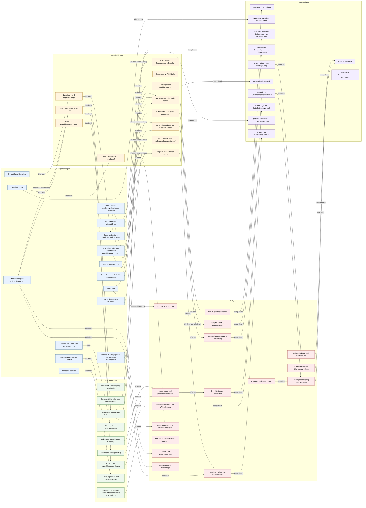

# Erbausschlagung

Erbausschlagungserklärung gegenüber dem Nachlassgericht mit Frist, Identität, Vertretung, Minderjährigen- oder Betreuungsbezug und Zustellnachweis.

[Turtle-Quelle](ontology.ttl) · [NaC-Vorlagengraph](https://github.com/notariat8/NaC/blob/862c87e1e378657f0066faed1bd36b830be2146d/usecases/erbausschlagung/knowledge-graph.graph.json) · [NaC-BPMN](https://github.com/notariat8/NaC/blob/862c87e1e378657f0066faed1bd36b830be2146d/bpmn/usecases/erbausschlagung.bpmn)

[Vollständiger Ablaufplan](../../sources/erbausschlagung/ablaufplan.md) · [Übernahme und Prüfpunkte](../../docs/erbausschlagung/import-notes.md) · [Synthetische Prüfszenarien](../../docs/erbausschlagung/synthetische-szenarien.md)

Ausgangspunkt dieses Fachgraphen sind **Vorlagenbegriffe** aus NaC; lokale Ergänzungen tragen eine `local.`-Kennung. `open` in der NaC-Quelle bedeutet eine offene Modellierungsfrage, keinen Status einer echten Akte. Die Pfeile zeigen fachliche Beziehungen; den zeitlichen Ablauf beschreibt das verlinkte BPMN-Modell. Eine notarielle Prüfung dieser Übernahme steht noch aus.

## Fallgraph

## Enthaltene Bausteine

| Gruppe | Anzahl |
| --- | ---: |
| Angabenfragen | 15 |
| Dokumenttypen | 9 |
| Entscheidungen | 12 |
| Prüfgates | 16 |
| Nachweistypen | 12 |

## Ergänzungen aus der Fachvorlage

Diese Einträge sind ein fachlicher Entwurf. Die Kapitelangabe verweist auf den vollständigen Ablaufplan; Entscheidungen und Prüfgates ersetzen keine Einzelfallprüfung.

| Kapitel | Baustein | Prüfgegenstand oder mögliche Optionen |
| --- | --- | --- |
| I | Auftragsumfang und Vollzugsleistungen | Auftrag getrennt nach Vorbereitung, Beglaubigung oder Beurkundung, Fristprüfung, Zuständigkeit, Genehmigungsverfahren, Versand, Empfangsbestätigung und Abschlussinformation klären. Steuerliche oder wirtschaftliche Gestaltung nur bei eigenem Auftrag. |
| I | Datensparsame Aktenanlage | Siehe Kapitel I des vollständigen Ablaufplans. |
| I | Fristenblatt und Wiedervorlagen | Fristenakte sofort anlegen, auch wenn Belege fehlen. Fristbeginn, vorläufiges Fristende, interne Vorfristen, Eingangskontrolle und Abschluss mit Verantwortlichkeit und Wiedervorlage erfassen. |
| I | Konflikt- und Beteiligtenprüfung | Siehe Kapitel I des vollständigen Ablaufplans. |
| II | Aufenthalt und Auslandswohnsitz des Erblassers | Welche Angaben und Nachweise sind für Aufenthalt und Auslandswohnsitz des Erblassers erforderlich? |
| II | Erhebungsbogen und Dokumentenliste | Siehe Kapitel II des vollständigen Ablaufplans. |
| II | Geschäftsfähigkeit und Aufenthalt der ausschlagenden Person | Welche Angaben und Nachweise sind für Geschäftsfähigkeit und Aufenthalt der ausschlagenden Person erforderlich? |
| II | Internationale Bezüge | Welche Angaben und Nachweise sind für Internationale Bezüge erforderlich? |
| II | Kenntnis von Erbfall und Berufungsgrund | Kenntnis vom Erbfall und vom Berufungsgrund getrennt erheben und durch Gerichtsschreiben oder nachvollziehbaren Aktenvermerk belegen. |
| II | Kinder und weitere mögliche Nachberufene | Welche Angaben und Nachweise sind für Kinder und weitere mögliche Nachberufene erforderlich? |
| II | Mehrere Berufungsgründe und Vor- oder Nacherbschaft | Welche Angaben und Nachweise sind für Mehrere Berufungsgründe und Vor- oder Nacherbschaft erforderlich? |
| II | Vorhandlungen am Nachlass | Besitznahme, Verfügung, Zahlung oder Geltendmachung von Nachlassverbindlichkeiten, Erbscheinsantrag und Kommunikation mit Banken oder Behörden als mögliche Annahmehandlungen erfassen. |
| III | Mögliche Annahme der Erbschaft | needs-notarial-review, none-indicated, possible |
| III | Nachrücken und Folgeerklärungen | needs-review, no, yes |
| III | Notarielle Prüfung von Sonderrisiken | Siehe Kapitel III des vollständigen Ablaufplans. |
| III | Risiko- und Eskalationsvermerk | Siehe Kapitel III des vollständigen Ablaufplans. |
| IV | Empfangendes Nachlassgericht | Gericht am letzten gewöhnlichen Aufenthalt des Erblassers und die Empfangsmöglichkeit am gewöhnlichen Aufenthalt des Ausschlagenden prüfen; Zweifel sofort eskalieren. |
| IV | Sechs Wochen oder sechs Monate | Grundsätzlich sechs Wochen prüfen; sechs Monate bei gesetzlich relevantem Auslandsbezug. Bei Verfügung von Todes wegen den besonderen Fristbeginn nach Bekanntgabe durch das Gericht beachten. |
| IV | Vier-Augen-Fristkontrolle | Kenntnisbelege, Fristbeginn und Fristende, interne Vorfrist sowie Versand mindestens im Vier-Augen-Prinzip prüfen. Maßgeblich ist der Gerichtszugang. |
| IV | Zuständigkeitsvermerk | Siehe Kapitel IV des vollständigen Ablaufplans. |
| V | Belehrungs- und Entscheidungsvermerk | Siehe Kapitel V des vollständigen Ablaufplans. |
| V | Entwurf der Ausschlagungserklärung | Siehe Kapitel V des vollständigen Ablaufplans. |
| V | Form der Ausschlagungserklärung | court-record, notarial-record-review, publicly-certified |
| V | Notarielle Belehrung und Willensklärung | Willen und Beweggründe klären; Folgen, Nachrücken, mehrere Berufungsgründe, Frist, Gerichtszugang und Grenzen einer gerichtlichen Eingangsbestätigung erläutern. |
| VI | Genehmigungsantrag und Fristwirkung | Vertretungsmacht, gemeinsamen Willen der Sorgeberechtigten, Genehmigungsantrag, Antragseingang, mögliche Fristwirkung und spätere Vorlage der Genehmigung prüfen. |
| VI | Genehmigungsbedarf für vertretene Person | Bei minderjährigen, betreuten oder sonst vertretenen Personen Genehmigungserfordernis und mögliche Ausnahme für nachrückende Kinder einzelfallbezogen prüfen; keine pauschale Aussage. |
| VI | Individueller Genehmigungs- und Fristnachweis | Siehe Kapitel VI des vollständigen Ablaufplans. |
| VI | Vertretungsmacht und Interessenkollision | Siehe Kapitel VI des vollständigen Ablaufplans. |
| VI | Öffentlich beglaubigte Vollmacht oder notarielle Bescheinigung | Siehe Kapitel VI des vollständigen Ablaufplans. |
| VII | Gerichtseingang überwachen | Bei beauftragtem Vollzug bis zum nachgewiesenen Gerichtseingang täglich kontrollieren, bei fehlender Bestätigung nachfassen und bei Risiko sofort eskalieren. |
| VII | Nachkontrolle ohne Vollzugsauftrag vereinbart? | agreed, not-agreed |
| VII | Quittierte Aushändigung und Hinweisvermerk | Quittierte Übergabe, Datum, übergebene Unterlagen und Hinweis auf Gerichtszugang als Nachweisart dokumentieren. |
| VII | Schriftlicher Hinweis bei Selbsteinreichung | Bei Selbsteinreichung schriftlich auf eigene Verantwortung, unverzügliche Einreichung und maßgeblichen Gerichtszugang hinweisen; keine Wirksamkeitszusage. |
| VII | Schriftlicher Vollzugsauftrag | Siehe Kapitel VII des vollständigen Ablaufplans. |
| VII | Versand- und Gerichtseingangsnachweis | Siehe Kapitel VII des vollständigen Ablaufplans. |
| VII | Versandform und gerichtliche Vorgaben | Je nach Urkundenform Original, Ausfertigung oder erforderliche Abschrift und aktuelle gerichtliche Vorgaben zur Übermittlung prüfen. |
| VII | Vollzugsauftrag an Notar erteilt? | Zwei alternative Wege: Notariat übernimmt Übermittlung und Zugangskontrolle oder Mandantschaft reicht selbst beim Gericht ein. Den Auftrag schriftlich festhalten. |
| VIII | Abschlussmitteilung beauftragt? | commissioned, not-commissioned |
| VIII | Eingangsbestätigung richtig einordnen | Gerichtliche Eingangsbestätigung nur als Nachweis des Eingangs behandeln; sie ist keine abschließende Bestätigung materieller oder formeller Wirksamkeit. |
| VIII | Gerichtliche Korrespondenz und Nachfragen | Siehe Kapitel VIII des vollständigen Ablaufplans. |
| VIII | Kontakt zu Nachberufenen begrenzen | Siehe Kapitel VIII des vollständigen Ablaufplans. |
| IX | Abschlussvermerk | Siehe Kapitel IX des vollständigen Ablaufplans. |
| IX | Aufbewahrung und Urkundensammlung | Siehe Kapitel IX des vollständigen Ablaufplans. |
| IX | Kostenrechnung und Kostenprüfung | Siehe Kapitel IX des vollständigen Ablaufplans. |
| IX | Vollständigkeits- und Endkontrolle | Urkunde, Identität, Fristenblatt, Vollmacht, Genehmigung, Versand, Zugang, Kommunikation, Kosten und offene Risiken vor Abschluss prüfen. |

## In NaC genannte Rechtsquellen

- [https://www.gesetze-im-internet.de/beurkg/](https://www.gesetze-im-internet.de/beurkg/)
- [https://www.gesetze-im-internet.de/bgb/__1945.html](https://www.gesetze-im-internet.de/bgb/__1945.html)

Diese Links dokumentieren die Quellen des NaC-Vorlagengraphen; sie belegen keine erneute rechtliche Prüfung.

## Pflege

Fachbegriffe und Beziehungen mit dem [Browser-Editor](../../README.md#im-browser-bearbeiten) oder in [ontology.ttl](ontology.ttl) ändern. Der Editor erzeugt diese Seite beim Speichern. Bei manueller Turtle-Pflege `python scripts/render_case_docs.py --write` ausführen und beide Änderungen gemeinsam reviewen.
