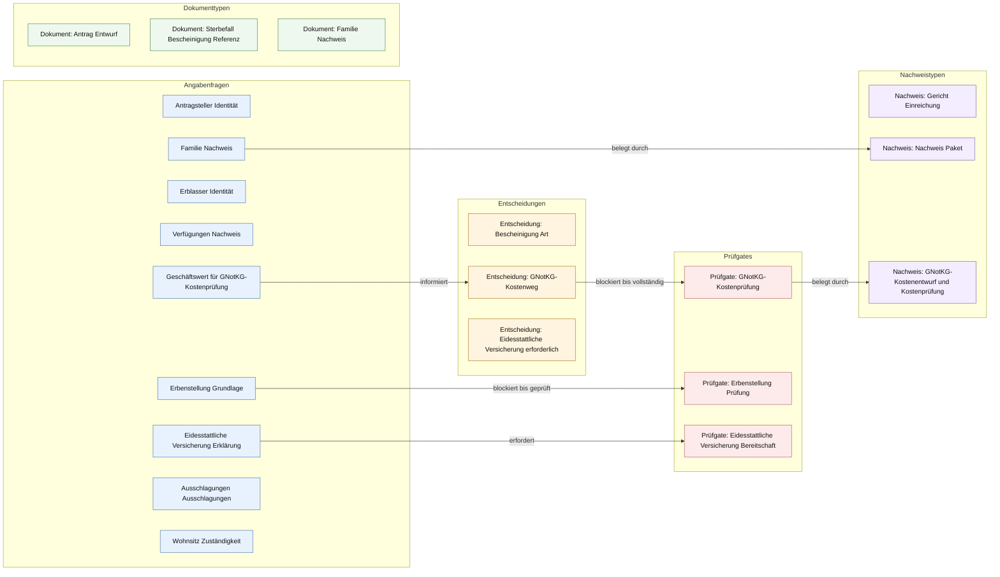

# Erbscheinsantrag / Nachlassangelegenheiten

Antrag und Erklärungen für Erbschein, Nachlassgericht, Ausschlagung, eidesstattliche Versicherung und erbrechtliche Nachweisführung.

[Turtle-Quelle](ontology.ttl) · [NaC-Vorlagengraph](https://github.com/notariat8/NaC/blob/862c87e1e378657f0066faed1bd36b830be2146d/usecases/erbscheinsantrag-nachlass/knowledge-graph.graph.json) · [NaC-BPMN](https://github.com/notariat8/NaC/blob/862c87e1e378657f0066faed1bd36b830be2146d/bpmn/usecases/erbscheinsantrag-nachlass.bpmn)

Ausgangspunkt dieses Fachgraphen sind **Vorlagenbegriffe** aus NaC; lokale Ergänzungen tragen eine `local.`-Kennung. `open` in der NaC-Quelle bedeutet eine offene Modellierungsfrage, keinen Status einer echten Akte. Die Pfeile zeigen fachliche Beziehungen; den zeitlichen Ablauf beschreibt das verlinkte BPMN-Modell. Eine notarielle Prüfung dieser Übernahme steht noch aus.

## Fallgraph

## Enthaltene Bausteine

| Gruppe | Anzahl |
| --- | ---: |
| Angabenfragen | 9 |
| Dokumenttypen | 3 |
| Entscheidungen | 3 |
| Prüfgates | 3 |
| Nachweistypen | 3 |

## In NaC genannte Rechtsquellen

- [https://www.gesetze-im-internet.de/beurkg/](https://www.gesetze-im-internet.de/beurkg/)
- [https://www.gesetze-im-internet.de/bgb/__2353.html](https://www.gesetze-im-internet.de/bgb/__2353.html)
- [https://www.gesetze-im-internet.de/gbo/](https://www.gesetze-im-internet.de/gbo/)

Diese Links dokumentieren die Quellen des NaC-Vorlagengraphen; sie belegen keine erneute rechtliche Prüfung.

## Pflege

Fachbegriffe und Beziehungen mit dem [Browser-Editor](../../README.md#im-browser-bearbeiten) oder in [ontology.ttl](ontology.ttl) ändern. Der Editor erzeugt diese Seite beim Speichern. Bei manueller Turtle-Pflege `python scripts/render_case_docs.py --write` ausführen und beide Änderungen gemeinsam reviewen.
