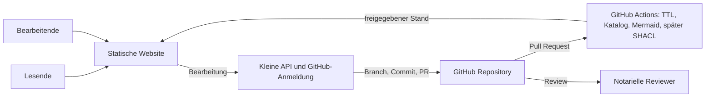

# NaC-Fallontologie als gehostete Pflegeplattform

Stand: 2026-09-28. Status: Architektur-Recherche und Aufwandsschätzung, keine Produktentscheidung und keine notarielle Fachfreigabe.

## Ausgangspunkt

- **USER-CONFIRMED:** Genau 20 kanonische NaC-Fälle; Turtle bleibt fachliche Pflegequelle, Mermaid wird daraus erzeugt. NaC-BPMN bleibt Quelle für den Prozessablauf. NaC pflegt per GitOps; Notarinnen und Notare prüfen fachlich.
- **USER-CONFIRMED:** Ziel ist eine webgehostete SaaS-Oberfläche mit geringem Änderungsvolumen, möglichst Open Source und GitHub als Repository.
- **ASSUMPTION:** Zunächst gibt es *einen* gemeinsamen NaC-Katalog für viele Lesende und wenige Bearbeitende, weiterhin ohne reale Akten oder Laufzeitwerte. Private Datenräume je Notariat wären ein anderes Produkt.
- **VERIFIED (Repository):** `ontology/core.ttl` und die 20 `cases/<slug>/ontology.ttl` sind die Pflegequelle. Ein statischer Suchindex kann beim Build erzeugt werden. Für diesen Katalog ist kein Triple Store erforderlich.

## Was Palantir öffentlich belegt

Der [Ontology Manager](https://www.palantir.com/docs/foundry/ontology-manager/overview) hat dauerhafte Suche, Erstellen und Branch-Auswahl, eine Discover-Startseite sowie eigene Seiten für Objekt-, Eigenschafts- und Beziehungstypen. Eine Objekttyp-Seite bündelt Metadaten, Eigenschaften, lokale Beziehungen, Abhängigkeiten, Daten und Nutzung. [Ontology proposals](https://www.palantir.com/docs/foundry/ontologies/review-ontology-proposals) erlauben Review einzelner Ressourcen mit Vorschau, Prüfern, Kommentaren und Änderungsverlauf. Das ist ein Produktvorbild für NaC.

Der [Backend-Überblick](https://www.palantir.com/docs/foundry/object-backend/overview) nennt Ontology Metadata Service, Objektdatenbanken, Object Set Service, Actions, Object Data Funnel und Functions on Objects. Sie verarbeiten auch laufende Objektdaten, Abfragen, Änderungen und Indexierung. Laut [Architekturüberblick](https://www.palantir.com/docs/foundry/architecture-center/overview) umfassen AIP und Foundry zusammen über 300 Dienste. **INFERENCE:** Für einen Git-versionierten Katalog mit 20 Fällen ohne Aktenwerte wäre dies überdimensioniert.

### Open-Source-Bezüge mit Evidenzgrenze

| Baustein | Öffentlich belegt | Bedeutung für NaC |
| --- | --- | --- |
| [Blueprint](https://github.com/palantir/blueprint) | Palantirs React-UI-Bibliothek (Apache-2.0). Palantir nennt Blueprint in der [Foundry-UI-Dokumentation](https://www.palantir.com/docs/foundry/object-views/widgets-filtering). | Geeignete Grundlage für dichte Desktop-Ansichten; liefert keine Ontologie- oder Review-Logik. |
| [Conjure](https://github.com/palantir/conjure) | Von Palantir veröffentlichter API-Generator für den eigenen Microservice-Ansatz. | Für eine kleine NaC-API nicht nötig. Seine Verwendung speziell im Ontology Manager ist öffentlich nicht belegt. |
| [Apache Spark](https://www.palantir.com/docs/foundry/ontologies/compute-usage) | Palantir dokumentiert Spark für Ontology-Indexierungsjobs. | Für kleine Turtle-Dateien und einen beim Build erzeugten Index unnötig. |
| [Kubernetes](https://www.palantir.com/docs/foundry/architecture-center/rubix) | Palantir beschreibt Rubix als Kubernetes-Unterbau für Foundry, AIP und Apollo. | Für eine kleine API nicht erforderlich. |

**OPEN:** Quellcode und genaue Komponenten des Ontology Managers selbst sind in den geprüften öffentlichen Quellen nicht offengelegt. Blueprint ist keine Open-Source-Ausgabe des Ontology Managers. Auch [AtlasDB](https://github.com/palantir/atlasdb) ist zwar ein öffentliches Palantir-Projekt; ein Einsatz im aktuellen Ontology Manager ist damit nicht bewiesen.

## Empfohlene Zielarchitektur für NaC

1. **Lesen:** Eine auf [GitHub Pages](https://docs.github.com/en/pages/getting-started-with-github-pages/what-is-github-pages) oder einem anderen statischen Host veröffentlichte Website erhält Suchindex, Fallseiten und fokussierte Graphdaten aus einem reproduzierbaren Build. Sie benötigt keinen eigenen Webserver.
2. **Bearbeiten:** Eine kleine API übernimmt Anmeldung, serverseitige GitHub-App-Geheimnisse, Rechteprüfung, Branch, Commit und Pull Request. GitHub Apps bieten fein abgestufte Rechte auf [Inhalte und Pull Requests](https://docs.github.com/en/apps/creating-github-apps/registering-a-github-app/choosing-permissions-for-a-github-app); [Nutzeraktionen](https://docs.github.com/en/apps/using-github-apps/authorizing-github-apps) können Personen zugeordnet werden. Die API kann als serverlose Funktion oder kleiner Dienst betrieben werden.
3. **Prüfen:** Der Editor zeigt semantischen Vorher/Nachher-Vergleich, betroffene Beziehungen und den Turtle-Diff. Bestehende Validierung läuft vor dem PR und in GitHub Actions. [Erforderliche Statusprüfungen](https://docs.github.com/en/pull-requests/reference/status-checks) und notarielle Fachfreigabe bleiben getrennte Gates.
4. **Daten:** Turtle bleibt die maßgebliche Fachquelle. Suchindex, Mermaid und Ansichten werden daraus generiert. NaC-BPMN wird verlinkt oder separat betrachtet; der Fachgraph erzeugt keinen Prozessablauf.

### Mögliche Open-Source-Bausteine

- [Blueprint](https://github.com/palantir/blueprint) für Bedienkomponenten; [Cytoscape.js](https://github.com/cytoscape/cytoscape.js) (MIT) für auf einen Baustein fokussierte Graphen. Beides ersetzt keine fachliche Informationsarchitektur.
- [RDFLib](https://github.com/RDFLib/rdflib) (BSD-3-Clause) für RDF/Turtle. Die vorhandene Python-Logik kann Ausgangspunkt für verlustarme Änderungen sein.
- [pySHACL](https://github.com/RDFLib/pySHACL) (Apache-2.0) für spätere Regelprüfung. Ein menschenfreundlicher SHACL-Editor ist ein eigenes Arbeitspaket.
- Für die kleine API ist ein leichtes Framework ausreichend; die konkrete Wahl folgt einem technischen Durchstich. Spark, Kafka, Kubernetes und ein Triple Store sind für die erste Version nicht begründet.

Der eigene Plattformcode kann gemäß Repository-Regel unter AGPL-3.0-or-later stehen und die Fachinhalte unter CC-BY-4.0; Drittbibliotheken benötigen ihre jeweiligen Lizenzhinweise. **GitHub als gehosteter Dienst ist selbst keine vollständig quelloffene Plattform.** Falls „alles Open Source“ später auch den Git-Host umfassen soll, ist [Forgejo](https://forgejo.org/) eine selbst betriebene Alternative mit Pull Requests und [Actions](https://forgejo.org/docs/latest/user/actions/reference/). Das würde jedoch Hosting, Updates, Backups und Betrieb des Git-Dienstes zusätzlich auf NaC verlagern. Für die genannte GitHub-Vorgabe ist GitHub daher die pragmatische Managed-Service-Ausnahme.

## Benötigte aktive Dienste

| Dienst | Erste Version | Zweck |
| --- | --- | --- |
| GitHub Repository, PRs, Actions | Ja, gemanagt | Quellstand, Review, Validierung, Publikation. Actions laufen ereignisbezogen. |
| Statisches Webhosting/CDN | Ja, gemanagt | Leseseiten und Frontend; bei öffentlichem Katalog kann GitHub Pages genügen. |
| Kleine API oder serverlose Funktionen | Ja, **wenn in der Website editiert wird** | Anmeldung, App-Schlüssel, Rechte, Branch/PR, serverseitige Prüfung. Serverlos bedeutet keinen eigenen 24/7-Prozess, aber einen aktiven Hosting-Dienst. |
| Geheimnisspeicher und Protokollierung | Ja, für Bearbeitung | Schlüssel und Betriebsdiagnose; gegebenenfalls Bestandteil des API-Hosts. |
| Eigene Datenbank, Triple Store, Suchcluster | Zunächst nein | Git ist bei wenig Änderungen die Quelle; Suche entsteht beim Build. |
| Separater Identity Provider | Zunächst nein, **wenn alle Bearbeitenden GitHub nutzen** | Andernfalls werden eigene Anmeldung und Rollenverwaltung nötig. |

**Sichtbarkeitsgrenze:** GitHub Pages ist normalerweise öffentlich erreichbar, auch wenn das Quell-Repository privat ist. [Private Pages](https://docs.github.com/en/enterprise-cloud%40latest/pages/getting-started-with-github-pages/changing-the-visibility-of-your-github-pages-site) setzen GitHub Enterprise Cloud und passende Organisationseinstellungen voraus. Für einen nicht öffentlichen Katalog ist die Hosting-Entscheidung daher vor Publikation zu treffen. [GitHub-Default](https://docs.github.com/en/enterprise-cloud%40latest/pages/getting-started-with-github-pages/securing-your-github-pages-site-with-https).

## Aufwandsschätzung

**ASSUMPTION:** Eine zentrale Instanz, 20 bestehende Fälle, wenige gleichzeitige Bearbeitende, GitHub-Konten, keine Aktenwerte, keine Abrechnung und keine zugesagte Verfügbarkeits-SLA. Die Spannen sind Entwickler-Personenwochen, keine Anbieterangebote; UX, notarielle Review-Zeit und Wartezeiten kommen hinzu.

| Arbeitspaket | Aufwand |
| --- | ---: |
| Datenvertrag, 20-Fälle-Import, UX-Konzept mit Erbausschlagung | 2–3 Wochen |
| Discover, Suche, Fall- und Bausteinseiten, fokussierter Graph | 3–5 Wochen |
| Strukturierte Pflege, Turtle-Roundtrip, semantischer Diff | 3–5 Wochen |
| GitHub-App-Anmeldung, Rechte, Branch/PR | 3–4 Wochen |
| Validierung, CI, Review-Status, Quellen/BPMN-Verknüpfung | 2–3 Wochen |
| Sicherheit, Barrierefreiheit, Notariats-Tests, Deployment | 3–5 Wochen |
| **Zentrale produktionsfähige Version** | **16–25 Entwicklerwochen** |

Ein **bedienbarer Pilot für Erbausschlagung** mit Suche, Bausteinseite, Änderung und PR-Vorschau erscheint in **6–9 Kalenderwochen** realistisch. Bei einer Vollzeit-Entwicklungskraft liegt die zentrale produktionsfähige Plattform etwa bei **4–6 Monaten**. Diese eigene Schätzung hat besonders bei verlustfreiem Turtle-Roundtrip, Authentifizierung und fachlicher Nutzerprüfung Unsicherheit.

Ein echtes **mehrmandantenfähiges SaaS** mit getrennten Notariatsräumen, eigenen Daten, Einladungen, Rollen, Auditprotokoll, Backups, Support und SLA ist ein anderer Umfang: grob **zusätzliche 4–8 Monate** mit mindestens zwei Entwicklungsrollen plus Betrieb/Sicherheit. Dann werden eine Datenbank für Mandanten- und Betriebsdaten und ein dauerhaft betriebener API-/Identitätsdienst wahrscheinlich. Die 20-Fälle-Ontologie kann Git-basiert bleiben; Aktenwerte gehören nicht hinein.

## Offene Produktentscheidungen und Abnahme

1. **OPEN:** Ist der Katalog öffentlich lesbar? Das bestimmt die Eignung von GitHub Pages.
2. **OPEN:** Eine zentrale NaC-Pflegeplattform oder getrennte private Räume je Notariat? Dies verändert Aufwand und Infrastruktur grundlegend.
3. **OPEN:** Müssen Bearbeitende ohne GitHub-Konto arbeiten? Dann braucht die Plattform einen weiteren Identitätsweg.
4. **Pilot-Abnahme:** Eine Person aus dem Notariat findet eine Frage, sieht Quelle, Status und Beziehungen, ändert sie ohne Turtle-Kenntnisse, prüft die semantische Vorschau und erstellt einen PR. Der RDF-Graph bleibt außerhalb der beabsichtigten Änderung inhaltlich gleich. Technische Checks und notarielle Freigabe sind getrennt sichtbar.

Palantirs Bedienkonzept ist ein Produktmaßstab, kein Hinweis auf frei verfügbaren Ontology-Manager-Code. NaC sollte zuerst diese konkrete Nutzerreise beherrschen und die GitOps-Regeln erhalten.
